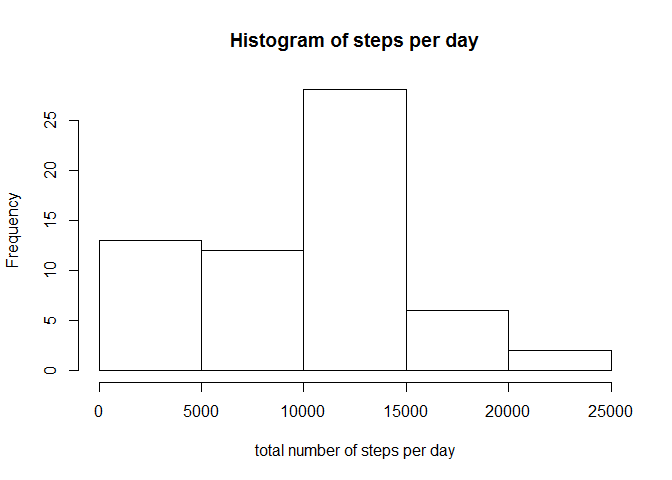
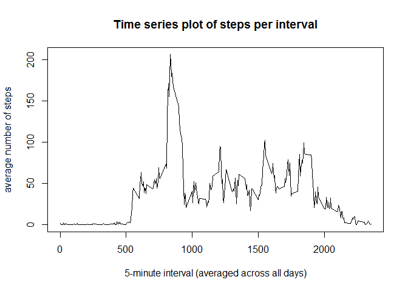
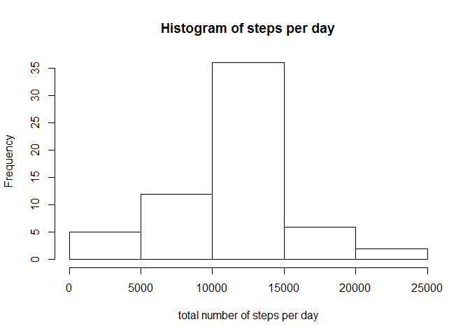
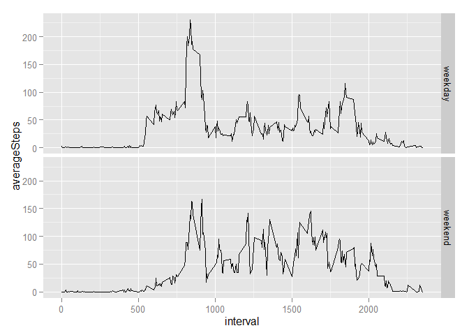

# Reproducible Research: Peer Assessment 1


## Loading and preprocessing the data

The assignment makes use of data from a personal activity monitoring device.This device collects data at 5 minute intervals through out the day. The data consists of two months of data from an anonymous individual collected during the months of October and November, 2012 and include the number of steps taken in 5 minute intervals each day.

1. First, We will load the data into R.


```r
# unzip file
unzip("activity.zip")

#Read the file into R
data <- read.csv("./activity.csv")
```

2. To make the data ready for use, we will convert the column date to a date variable.

```r
library(lubridate)
data$date <- ymd(data$date)
```


## What is mean total number of steps taken per day?

1. We will calculate the total number of steps taken per day.

```r
library(dplyr)
dataGrouped <- group_by(data, date)
total <- summarize(dataGrouped, stepsDay = sum(steps, na.rm = TRUE))
total
```

```
## Source: local data frame [61 x 2]
## 
##          date stepsDay
## 1  2012-10-01        0
## 2  2012-10-02      126
## 3  2012-10-03    11352
## 4  2012-10-04    12116
## 5  2012-10-05    13294
## 6  2012-10-06    15420
## 7  2012-10-07    11015
## 8  2012-10-08        0
## 9  2012-10-09    12811
## 10 2012-10-10     9900
## ..        ...      ...
```

2. Then, we will make a histogram of the total number of steps taken each day.

```r
hist(total$stepsDay, main='Histogram of steps per day', xlab = "total number of steps per day")
```

 

3. The following code produces the mean and median total number of steps taken per day.

```r
mean(total$stepsDay)
```

```
## [1] 9354.23
```

```r
median(total$stepsDay)
```

```
## [1] 10395
```


## What is the average daily activity pattern?

1. We will make a time series plot of the 5-minute interval.


```r
dataGroupedInterval <- group_by(data, interval)
average <- summarize(dataGroupedInterval, averageInterval = mean(steps, na.rm = TRUE))

plot(average$interval, average$averageInterval, type="l",
     main = "Time series plot of steps per interval",
     xlab = "5-minute interval (averaged across all days)", ylab="average number of steps")
```

 

2. The following 5-minute interval contains the maximum number of steps


```r
filter(average, averageInterval == max(average$averageInterval))
```

```
## Source: local data frame [1 x 2]
## 
##   interval averageInterval
## 1      835        206.1698
```


## Imputing missing values

1. The total number of missing values in the dataset are as follows

```r
sum(is.na(data))
```

```
## [1] 2304
```

2. We will impute the missing variables in the column "steps"" with the mean number of steps for that given time interval.

3. This will give us a new dataset that is equal to the original dataset but with the missing data filled in.

```r
imputedData <- mutate(dataGroupedInterval, stepsMean=mean(steps, na.rm=TRUE))
for(i in 1:nrow(dataGroupedInterval)) {
  if (is.na(imputedData$steps[i] == TRUE)){
    imputedData$steps[i] <- imputedData$stepsMean[i]
  }
}

imputedData <- select(imputedData, -(stepsMean))
```

4. Consequently, we will make a histogram of the total number of steps taken each day and report the mean and median total number of steps taken per day.


```r
#Calculate the total number of steps taken each day
dataImputedGrouped <- group_by(imputedData, date)
totalImputed <- summarize(dataImputedGrouped, stepsDay = sum(steps, na.rm = TRUE))

# Make a histogram of the total number of steps taken each day
hist(totalImputed$stepsDay, main='Histogram of steps per day', xlab = "total number of steps per day")
```

 

```r
mean(totalImputed$stepsDay)
```

```
## [1] 10766.19
```

```r
median(totalImputed$stepsDay)
```

```
## [1] 10766.19
```

These values differ from the values above. Imputing with the mean number of steps in each time interval made the mean and median slightly larger. 


## Are there differences in activity patterns between weekdays and weekends?

1. We will create a new factor variable to indicate whether a given date is a weekday or weekend day.

```r
ungroup(imputedData)
```

```
## Source: local data frame [17,568 x 3]
## 
##        steps       date interval
## 1  1.7169811 2012-10-01        0
## 2  0.3396226 2012-10-01        5
## 3  0.1320755 2012-10-01       10
## 4  0.1509434 2012-10-01       15
## 5  0.0754717 2012-10-01       20
## 6  2.0943396 2012-10-01       25
## 7  0.5283019 2012-10-01       30
## 8  0.8679245 2012-10-01       35
## 9  0.0000000 2012-10-01       40
## 10 1.4716981 2012-10-01       45
## ..       ...        ...      ...
```

```r
imputedData$day <- weekdays(imputedData$date)

imputedData$day[imputedData$day == 'Monday' | imputedData$day == 'Tuesday' 
                | imputedData$day == 'Wednesday' | imputedData$day == 'Thursday' 
                | imputedData$day == 'Friday'] <- 'weekday'

imputedData$day[imputedData$day == 'Saturday' | imputedData$day == 'Sunday'] <- 'weekend'

imputedData$day <- as.factor(imputedData$day)

imputedDataGrouped <- imputedData %>%
  group_by(day, interval) %>%       
  summarize(averageSteps = mean(steps, na.rm=TRUE))
```

2. Then we will make a panel plot containing a time series plot of the 5-minute interval  and the average number of steps taken, averaged across all weekday days or weekend days.


```r
library(ggplot2)
g <- ggplot(imputedDataGrouped, aes(interval, averageSteps))
qplot(interval, averageSteps, data = imputedDataGrouped, facets = day~., geom = c('line'))
```

 
